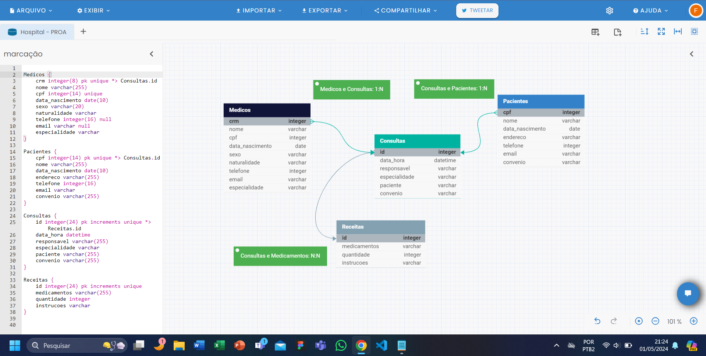

# Hospital Fundamental

Este repositório contém o diagrama Entidade-Relacionamento do banco de dados de um hospital que necessita de um sistema para auxiliar no controle e registro das consultas realizadas. Foi criado entidades para os médicos, pacientes, consultas realizadas e para os medicamentos receitados pelos médicos:

- Médicos: CRM, como chave principal e chave estrangeira

- Pacientes: CPF, como chave principal e chave estrangeira
  
- Consultas: id, como chave principal e chave estrangeira

- Medicamentos: id, como chave principal

